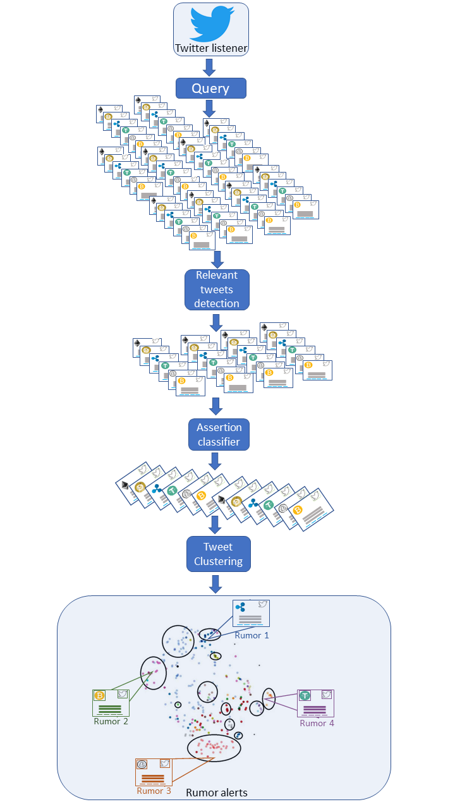

# Detecting Cryptocurrency Rumors Using Twitter

I developed a system for detecting cryptocurrency rumors using twitter. The system is based on text classification and clustering. Using machine learning techniques with the support of cryptocurrency experts I was able to achieve a high precision rate with limited amounts of labeled data, combining simple models with qualitative analysis. The system can be easily converted to other subjects of interest with minor model adjustments.

This overview will focus on the central part of the system - the machine learning part. The specifics of the collection of tweets and the notification system on both ends of the chain will not be detailed.

<strong>Introduction</strong>

Cryptocurrencies are one of the few assets whose presence is exclusively online. Because of this fact and their decentralized nature, their value is determined solely by the value that assigned by people. Thus, their value should relate to non formal online discussions such as social media. Using Twitter is an effective option to capture the "wisdom of the crowd" in order to gain an edge in cryptocurrency trading world.

In order to capture the market moving talks a system that <strong>listens,detects, filters, classifies, clusters and sends</strong> cryptocurrency rumors and then finally <strong>alerts </strong>the costumer of the rumor, was built.

<strong>The system</strong>

<li><strong>Listener </strong></li></ol>

A queue is filled with tweets that pass a predefined query.

An example of a query:

+BTC

+bitcoin

-buy now

There must be at least one positive (+) word and no negative (-) words.

<ol>

<li><strong>Detection</strong></li></ol>

Tweets are passed through specific topic filters that only let through tweets that match one of the topics defined.

The topics supported are:

<ul>

<li>Technological improvements\development announcement
<li>Adoption by payment companies\merchants & adoption in the crypto-based payment ecosystem
<li>Adoption of blockchain or cryptocoins by government & policy and regulatory decision
<li>New listing in exchanges
<li>Partnerships
<li>Exchange shutdown/hack
<li>Mainstream media
<li>Airdrop</li></ul>

The topic filter consists of a number of stages:

<ol>

<li>A base filter that removes all tweets that have less than 5 English words.
<li>A mandatory word family filter - allow tweets only if they contain at least one word from each family
<li>Optional filters (must pass at least one) : <ol>

 <li>Optional word family filter - checks if any words in the tweet belong to one of these word families
 <li>Coin-specific terms - checks if any of the terms specific to the coin associated with the tweet appears in the tweet
 <li>hashtags - checks if any of a set of hashtags appear in the tweet</li> </ol>
</li> </ol>

A tweet must pass all three stages to make it through to the next level.

<strong>3. Classification</strong>

We divided the different speech acts [2] into 2 groups:

<ol>

<li>Assertions: An assertion is a tweet that can be literally characterize as true or false.
<li>Non assertions: speech acts such as questions, recommendation, expressions and requests.</li></ol>

>>>>>  gd2md-html alert: inline image link here (to images/Detecting-Cryptocurrency1.png). Store image on your image server and adjust path/filename if necessary.  (<a href="#">Back to top</a>)(<a href="#gdcalert3">Next alert</a>) >>>>> 

Figure 2: An assertion tweet (left) vs. a non assertion tweet (right)

We were only able to manually label 1500 tweets and therefore could not build a deep neural network. Hence, we had to do our best with algorithms that do not require a high number of labeled examples.

In order to build the classifier we hand crafted the features for the model.

Feature Extraction

The features that were extracted for the different classifiers were:

<ul>

<li>is_quoted_status - Indicates whether this is a Quoted Tweet
<li>account
<li>num_hashtag - The number of hashtags in the tweet
<li>num_at - The number of @ in the tweet
<li>num_retweet_symbol - The number of RT or rt in the tweet.
<li>num_question_mark - The number of question marks in the tweet.
<li>num_exclamation_mark - The number of exclamation marks in the tweet.
<li>tweet_has_emoticons - The number of emoticons in the tweet[4].
<li>tweet_num_interjections - The number of interjections in the tweet, as tagged by NLTK POStagger[14] .
<li>num_adjectives - The number of adjectives as tagged by NLTK POS tagger[14] .
<li>num_pronouns - The number of pronouns in the tweet, as marked by the NLTK POS tagger [14] .
<li>num_links - The number of links mapped as xxlinkxx in the tweet.
<li>num_number_words - The number of words mapped as xxnumberxx, xxpercentxx or xxdollarsxx
<li>tweet_numcurrencies - The number of currencies in the tweet, meaning the $ followed by a word, for example $BCH
<li>num_vulgar_words - The number of vulgar words in the tweet[ 5].
<li>num_abbreviations - The number of abbreviations in the tweet, for example AKA, FYI.[6]
<li>num_strong_words - The number of words in the tweet carrying strong semantic meaning. </li></ul>

Assertion classifier model:

In order to separate the assertions for the rest of the speech acts we used several classification algorithms such as SVM, Random forest, gradient boosting, xgboost, but logistic regression produced the best results[11]:

>>>>>  gd2md-html alert: inline image link here (to images/Detecting-Cryptocurrency2.png). Store image on your image server and adjust path/filename if necessary.  (<a href="#">Back to top</a>)(<a href="#gdcalert4">Next alert</a>) >>>>> 

Figure 3: Assertion classifier results

With the naive prediction threshold (0.5), the accuracy is ~ 72.6%, which is far better than random, but doesn't necessarily meet the business requirements.

>>>>>  gd2md-html alert: inline image link here (to images/Detecting-Cryptocurrency3.jpg). Store image on your image server and adjust path/filename if necessary.  (<a href="#">Back to top</a>)(<a href="#gdcalert5">Next alert</a>) >>>>> 

Figure 4: Assertion classifier confusion matrix, (left hand side is predicted, top is actual)

It's important to notice that we want to maximize recall at this stage, because we are willing to let some irrelevant tweets through the filter (this is what we pay in precision), in order to ensure that most of what is true also passes through the filter.

This is a precision recall curve which shows this trade-off for different thresholds. A threshold with a trade-off that meets the customer's needs is marked with a red circle:

<ul>

<li>Precision: 0.67
<li>Recall: 0.82
<li>Decision threshold: 0.42 </li></ul>

>>>>>  gd2md-html alert: inline image link here (to images/Detecting-Cryptocurrency4.png). Store image on your image server and adjust path/filename if necessary.  (<a href="#">Back to top</a>)(<a href="#gdcalert6">Next alert</a>) >>>>> 

Figure 5: Precision- recall curve

<strong>4 Clustering</strong> 
TensorFlow's word2vec model is used to create vector representations for words in the cryptocurrency domain [6]. 
 
The word2vec model has been trained on cryptocurrency tweets (~10 million), for 10 epochs, in order to create a 200 dimensional vector for each word appearing in the tweet corpus.

Currently a tweet is represented by taking the vectors of all the words and averaging them [12].

Clustering process: 

<ul>

<li>Each rumour starts off as a single tweet, and once a new tweet arrives, it is linked to an existing rumour only if it passes the threshold for joining a new rumour (if several rumours are relevant, the maximal similarity is taken).

    The similarity metric for two tweets that we are using is the cosine similarity [13].

<ul>

<li>Once a new tweet is linked to an existing rumour, its vector representation is added and averaged with the existing vector in order to create a centroid for the rumour. Subsequent tweet vectors are measured against the rumour centroid.
<li>Beyond vector embeddings, the first rule to be used is whether the tweet is a retweet or a quoted tweet. If this is the case, the rumour detector checks whether the original tweet exists as a representative for one of the rumours. If so, the tweet is automatically clustered and added to the original tweet (vector embedding and centroid update is still performed).</li></ul>
</li></ul>

>>>>>  gd2md-html alert: inline image link here (to images/Detecting-Cryptocurrency5.jpg). Store image on your image server and adjust path/filename if necessary.  (<a href="#">Back to top</a>)(<a href="#gdcalert7">Next alert</a>) >>>>> 

>>>>>  gd2md-html alert: inline image link here (to images/Detecting-Cryptocurrency6.png). Store image on your image server and adjust path/filename if necessary.  (<a href="#">Back to top</a>)(<a href="#gdcalert8">Next alert</a>) >>>>> 

>>>>>  gd2md-html alert: inline image link here (to images/Detecting-Cryptocurrency7.jpg). Store image on your image server and adjust path/filename if necessary.  (<a href="#">Back to top</a>)(<a href="#gdcalert9">Next alert</a>) >>>>> 

Figure 6: The clustering process

>>>>>  gd2md-html alert: inline image link here (to images/Detecting-Cryptocurrency8.jpg). Store image on your image server and adjust path/filename if necessary.  (<a href="#">Back to top</a>)(<a href="#gdcalert10">Next alert</a>) >>>>> 

Figure 7: Embedding of pre-labeled rumours showing the results, each rumour is a color, and each point is a tweet

<strong>5. Alerting</strong>

If a tweet has passed the clustering stage there are 2 possible outcomes:

<ol>

<li>It creates a new rumor and the customer is alerted. 
<li>If a tweet is added to an existing cluster the rumor "grows" but no new notification is sent.</li></ol>

The tweets than moves on to the analysts' portal and in case it creates a new rumor, it is sent to the customer via a Slack message.

>>>>>  gd2md-html alert: inline image link here (to images/Detecting-Cryptocurrency9.png). Store image on your image server and adjust path/filename if necessary.  (<a href="#">Back to top</a>)(<a href="#gdcalert11">Next alert</a>) >>>>> 

Figure 8: Screenshot of the analysts' portal for monitoring the system. Each column is a different coin and each box is a rumor.

>>>>>  gd2md-html alert: inline image link here (to images/Detecting-Cryptocurrency10.png). Store image on your image server and adjust path/filename if necessary.  (<a href="#">Back to top</a>)(<a href="#gdcalert12">Next alert</a>) >>>>> 

Figure 9: Screenshot of the Slack messages sent to the customer

<strong>Results analysis</strong>

A cryptocurrency expert reviewed 2432 historical tweets which were clustered into 615 rumor clusters in order to evaluate the system

>>>>>  gd2md-html alert: inline image link here (to images/Detecting-Cryptocurrency11.png). Store image on your image server and adjust path/filename if necessary.  (<a href="#">Back to top</a>)(<a href="#gdcalert13">Next alert</a>) >>>>> 

Figure 10: The distribution of tweets sent to the customer 

We can measure precision (and not accuracy or recall) since we can only evaluate the tweets that passed through the system. The millions of tweets that were dropped by one of the system's filters cannot be accounted for.

Good tweets - Relevant and clustered together with other rumors in the same subject.

Query issue - Tweets that passed the query filter because the query was not defined correctly and needs to be updated.

Lexicon issue -  Similar to the query issue, these are tweets that have passed the lexicon rules because the rules were not defined correctly or have been defined in a way that was ovefitted on the rule's creator data.

Assertion issue - Tweets that were wrongly classified as assertion using the logistic regression classifier.

Cluster issue - Tweets that were clustered into the wrong rumor cluster, and tweets that created a new cluster instead of being cluster to an existing rumor.

<strong>Conclusions</strong>

The system's precision is seemingly low (~40%) but in this long pipeline, where the error accumulates in each step, 40% is reasonably high.  Furthermore the costumer would rather filter irrelevant tweets by hand than miss a market moving rumor.

<strong>Further research in progress:</strong>

<ul>

<li>Testing TensorFlow's universal sentence encoder in order to create a more robust tweet encoder [7]
<li>Using TensorFlow's universal sentence encoder in the pipeline in order to classify assertions [7].
<li>Building a rumor verification mechanism in order to reduce the false positives
<li>Building a user classifier in order to remove the spamming users and assigning higher importance to the influencing users [9].
<li>Adding telegram groups and sub reddits to the rumor system.</li></ul>

<strong>References</strong>

[1] Soroush Vosoughi 2015: Automatic Detection and Verification of Rumors on Twitter

<a href="https://www.media.mit.edu/cogmac/publications/Soroush_Vosoughi_PHD_thesis.pdf">https://www.media.mit.edu/cogmac/publications/Soroush_Vosoughi_PHD_thesis.pdf</a>

[2] Connor Lamon, Eric Nielsen, Eric Redondo: Cryptocurrency Price Prediction Using News and Social Media Sentiment

<a href="http://cs229.stanford.edu/proj2017/final-reports/5237280.pdf">http://cs229.stanford.edu/proj2017/final-reports/5237280.pdf</a>

[3] J. R. Searle. A taxonomy of illocutionary acts. Linguistic Agency University of Trier, 1976.

<a href="http://mcps.umn.edu/assets/pdf/7.8_Searle.pdf">http://mcps.umn.edu/assets/pdf/7.8_Searle.pdf</a>

[4] Emoji Unicode Tables 
<a href="https://apps.timwhitlock.info/emoji/tables/unicode">https://apps.timwhitlock.info/emoji/tables/unicode</a>

[5] List of Swear Words, Bad Words, & Curse Words

<a href="https://www.noswearing.com/dictionary">https://www.noswearing.com/dictionary</a>

[6] acronyms and text messages

<a href="https://www.netlingo.com/category/acronyms.php">https://www.netlingo.com/category/acronyms.php</a>

[7] Words with strong semantic meanings

<a href="http://www.wjh.harvard.edu/">http://www.wjh.harvard.edu/</a>

[8] Distributed Representations of Words and Phrases and their Compositionality

<a href="https://papers.nips.cc/paper/5021-distributed-representations-of-words-and-phrases-and-their-compositionality.pdf">https://papers.nips.cc/paper/5021-distributed-representations-of-words-and-phrases-and-their-compositionality.pdf</a>

[7] Daniel Cer, Yinfei Yang, Sheng-yi Kong, Nan Hua, Nicole Limtiaco, Rhomni St. John, Noah Constant, Mario Guajardo-Céspedes, Steve Yuan, Chris Tar, Yun-Hsuan Sung, Brian Strope, Ray Kurzweil. Universal Sentence Encoder. arXiv:1803.11175, 2018.

<a href="https://arxiv.org/pdf/1803.11175.pdf">https://arxiv.org/pdf/1803.11175.pdf</a>

[8] Atish Pawar, Vijay Mago Calculating the similarity between words and sentences using a lexical database and corpus statistics

<a href="https://arxiv.org/pdf/1802.05667.pdf">https://arxiv.org/pdf/1802.05667.pdf</a>

[9]Kang Zhao John Yen Greta Greer Baojun Qiu Prasenjit Mitra Kenneth Portier:

Finding influential users of online health communities: a new metric based on sentiment influence

<a href="https://academic.oup.com/jamia/article/21/e2/e212/702646">https://academic.oup.com/jamia/article/21/e2/e212/702646</a>

[10] Twitter's api reference index 

<a href="https://developer.twitter.com/en/docs/api-reference-index">https://developer.twitter.com/en/docs/api-reference-index</a>

[11] sklearn logistic regression implementation

<a href="https://scikit-learn.org/stable/modules/generated/sklearn.linear_model.LogisticRegression.html">https://scikit-learn.org/stable/modules/generated/sklearn.linear_model.LogisticRegression.html</a>

[12] Sanjeev Arora, Yingyu Liang, Tengyu Ma 2017:A SIMPLE BUT TOUGH-TO-BEAT BASELINE FOR SENTENCE EMBEDDINGS

<a href="https://openreview.net/forum?id=SyK00v5xx">https://openreview.net/forum?id=SyK00v5xx</a>

[13] K.P.N.V.Satya sree  , Dr.J V R Murthy: CLUSTERING BASED ON COSINE SIMILARITY MEASURE

<a href="https://pdfs.semanticscholar.org/f009/fc0d202f4a3546cc471534714b472136dca9.pdf?_ga=2.150704946.585191832.1542147000-208198622.1542147000">https://pdfs.semanticscholar.org/f009/fc0d202f4a3546cc471534714b472136dca9.pdf?_ga=2.150704946.585191832.1542147000-208198622.1542147000</a>

[14] Beatrice Santorini 1990: Part-of-Speech Tagging Guidelines for the Penn Treebank Project 

<a href="https://repository.upenn.edu/cgi/viewcontent.cgi?article=1039&context=ircs_reports">https://repository.upenn.edu/cgi/viewcontent.cgi?article=1039&context=ircs_reports</a>

